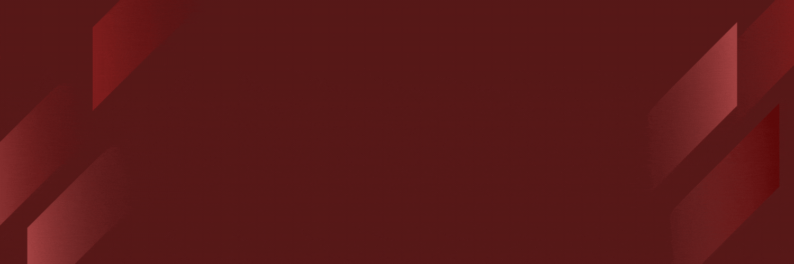

  

<h1 align="center">Hi there, I'm Shaza 👋</h1>

  
  

---

### 💻 About Me
A creative **Web Application and Website Developer** who loves building digital experiences that blend functionality with aesthetics. 🌿

* 🔭 **Currently:** Enhancing my skills in modern web frameworks.
* 🎨 **Vibe:** Minimalist, efficient, and user-friendly designs.
* ☕ **Goal:** To create websites that have "soul and life".

### 🛠 Tech Stack

  
  
  
  

### 📫 Let's Connect

---

<i>"Coding with heart and creativity" ✨</i>

