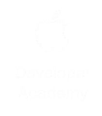
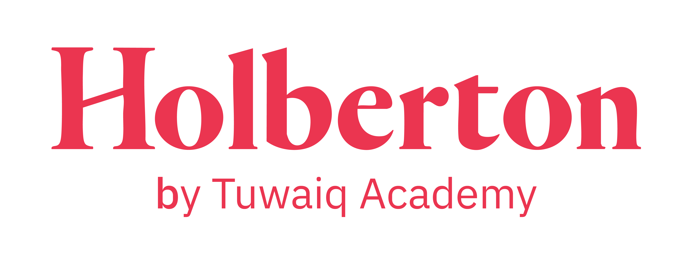

  

  

### 👩🏻‍💻 About Me
A creative **iOS Developer** and **UI/UX Designer** with a deep passion for building applications that are not only powerful but also visually captivating. As an **Apple Developer Academy alumna**, I learned how to blend Apple's design philosophy with robust coding practices.

---

### Currently expanding my expertise in Software Engineering through👇🏻:

  
  &nbsp;&nbsp;&nbsp;&nbsp;
  
  &nbsp;&nbsp;&nbsp;&nbsp;
  

* 🎓 **Currently honing my Full-stack skills at** **[@Holberton School | Tuwaiq Academy](https://holberton.tuwaiq.edu.sa/)**
* 🍎 **Proud Alumna of** **[@Apple Developer Academy | Tuwaiq Academy](https://developeracademy.tuwaiq.edu.sa/)**

--- 

### 🛠 Tech Stack

#### 📱 Mobile & Tools

  
  
  

#### 🌐 Web & Backend

  
  
  

#### 🎨 Design & Tools

---

### 📫 Let's Connect

---

  

